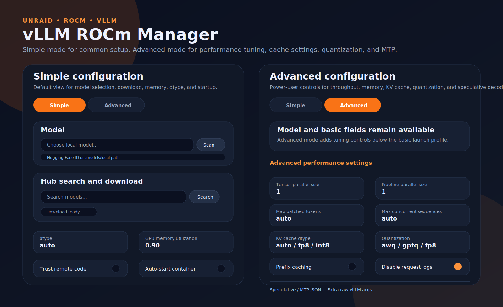

# vLLM ROCm Manager for Unraid

A custom Unraid Community Applications template and Docker image for managing vLLM ROCm on AMD GPUs.

The image is based on the official `vllm/vllm-openai-rocm:latest` runtime and adds a modern WebUI for selecting local models, searching the model hub, downloading models to Unraid storage, editing vLLM settings, starting/stopping/restarting the vLLM process, previewing the launch command, and viewing logs.

## Screenshot



## Included app

- **vLLM ROCm Manager**: WebUI on port `8080`, OpenAI-compatible vLLM API on port `8000`.

## Features

- Modern responsive WebUI
- Light and dark mode
- Model hub search
- Background model downloads into `/models`
- Local model scanner for `/models`
- Hub model ID entry
- Persistent config under `/config/config.json`
- Start, stop, and restart vLLM from the browser
- Command preview
- Logs panel
- Advanced vLLM tuning fields:
  - dtype
  - GPU memory utilization
  - max model length
  - max batched tokens
  - max sequences
  - tensor and pipeline parallel size
  - KV cache dtype, including fp8/int8 options exposed by vLLM
  - quantization
  - prefix caching
  - CPU offload
  - swap space
  - trust remote code
  - speculative/MTP JSON
  - raw extra vLLM args

## Repository layout

```text
Dockerfile
app/server.py
app/static/index.html
app/static/styles.css
app/static/app.js
ca_profile.xml
templates/vllm-rocm.xml
docs/vllm-rocm.md
docs/webui-screenshot.svg
.github/workflows/docker-publish.yml
icon.svg
LICENSE
```

## Unraid paths

Default mappings:

```text
/mnt/user/appdata/vllm/config -> /config
/mnt/user/appdata/vllm/cache  -> /root/.cache/huggingface
/mnt/user/appdata/vllm/models -> /models
```

Downloaded models are stored under `/models`, which maps to `/mnt/user/appdata/vllm/models` by default.

## Usage

1. Install the Community App template.
2. Open the WebUI at `http://UNRAID_IP:8080`.
3. Search the model hub, download a model, or pick a local model from `/models`.
4. Tune settings.
5. Click **Start** or **Restart**.
6. Point Open WebUI or another OpenAI-compatible client at:

```text
http://UNRAID_IP:8000/v1
```

## Docker image

The GitHub Actions workflow publishes:

```text
ghcr.io/josenzhong/vllm-rocm:latest
```

## Submission notes

After meaningful XML changes, use the Community Applications submission page to run **Validate** and then **Scan** before submitting for review.

## Support

Please open an issue in this repository for template-specific problems. For vLLM runtime issues, also check the upstream vLLM project documentation and issue tracker.
